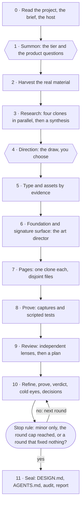

<p align="center">
  
</p>

<h1 align="center">genjutsu</h1>

<p align="center"><em>The art of illusion. Cast motion. Paint signatures. Summon shadow clones.</em></p>

<p align="center">
  <a href="https://genjutsu.athevon.dev"><strong>Website</strong></a>
  &nbsp;·&nbsp;
  <a href="https://genjutsu.athevon.dev/docs"><strong>Documentation</strong></a>
  &nbsp;·&nbsp;
  <a href="https://genjutsu.athevon.dev/docs/install"><strong>Install</strong></a>
  &nbsp;·&nbsp;
  <a href="https://github.com/AThevon/genjutsu/discussions"><strong>Discussions</strong></a>
</p>

<p align="center">
  <a href="https://github.com/AThevon/genjutsu/releases/latest"></a>
  <a href="./LICENSE"></a>
  
  <a href="https://github.com/sponsors/AThevon"></a>
</p>

Creative coding skills for [Claude Code](https://claude.ai/code), [claude.ai](https://claude.ai) and [Cowork](https://claude.com/plugins-for/cowork), at three scales: `cast` makes one interface move, `paint` gives a product its visual identity, and `bunshin` builds a whole website or web app with a team of agents under one art director. Covers Web (React, Vue, Svelte, Astro, vanilla CSS, Three.js, Canvas), Android (Jetpack Compose, Compose Multiplatform), and Apple (SwiftUI iOS + macOS); `bunshin` is web only for now.

> **v3.0 - rebrand**: this plugin used to be called `creative-excellence`. The skills `/creative-excellence:creative-excellence` and `/creative-excellence:design-excellence` are now `/genjutsu:cast` and `/genjutsu:paint`. See [CHANGELOG.md](./CHANGELOG.md) for the migration steps if you had v2.x installed.

---

## What v4.1 changes: bunshin

`cast` and `paint` are one agent doing careful work. `bunshin` (影分身, the shadow clones) is what happens when the job is a whole site and one agent is not enough: **one art director, many clones**. You answer two rounds of questions, plus a yes if the run should go past the tier's round cap. Everything else, from harvesting the client's real material to the last refine round, runs on its own; the decisions it takes are written in the report, and every finding cites a capture region or a `file:line`.



**Who does what.** bunshin does not replace the other pieces, it conducts them.

| Piece | Its part in a bunshin run |
|---|---|
| **You** | Two answers: the tier (and so the budget) with the product questions, then the direction. |
| **The art director** (the main agent) | Writes the direction contract, builds the foundation and the signature surface itself, reads the first screen of every page, turns the cold-eyes notes into rules, decides when to stop. |
| **The clones** (subagents) | Research from four angles, build one page each on files no other clone touches, review through independent lenses, apply the plan owner by owner. Each one starts from a written brief and nothing else. |
| **[Impeccable](https://impeccable.style)**, when installed | The product interview, a visual direction drawn instead of defaulted (seven worlds ordered before the draw, challengers, a decision page), its quality floor, its detector, image provenance, its finish reviewer and its documenter. genjutsu never bundles or installs it without asking. |
| **genjutsu's modules** | The interaction thesis on every direction card, `tells`, motion, mobile and desktop principles, the platform APIs, and the audit that closes the run. |

**What makes it hold.** The rules come from one measured run, and from what broke in it:

- **Two human touches, and the cost first.** Nothing heavier than reading runs before you pick a tier. The first message says what the host can do, whether Impeccable is there, and what each tier is expected to cost.
- **Disjoint ownership.** Every clone owns a declared list of files. A shared need goes back as a request, never as an edit; when a shared contract changes, the shared owner runs first and alone.
- **Builds in copies, captures without a server.** Clones build in isolated copies with the framework's own binary. `shoot.mjs`, a zero-dependency harness, captures the static build in headless Chrome by answering every request to its fake origin from disk: no dev server and no fixed port (the browser's DevTools endpoint takes a free port the OS picks), so every clone can capture at once.
- **Evidence or it did not happen.** Every finding cites a capture region or a `file:line`, every behaviour is reported with the value a scripted test measured.
- **A cold-eyes art director.** After a round of fixes (at every verdict on the full tier, the first one on standard, never on lean), one reviewer sees the site for the first time, with no history. Its notes become rules in a decisions file, not a task list. In the measured run, its notes led to the two decision rounds that closed the build.
- **The loop ends on a rule.** Nothing above minor left, the tier's round cap, or a round that fixed nothing. Never open-ended.

**The workflows are code, and CI runs them.** The five fan-outs (research, build, review, refine, verdict) are workflow templates in `skills/_jutsu/orchestration/workflows/`, parameterised by `args`. `scripts/check-workflows.mjs` runs each one against stubbed agents on every PR: to the end on its fixtures with every agent answering, and again with every agent answering null, where it must end or stop on a deliberate error, never crash. The run bunshin comes from lost a whole fan-out to a placeholder string where a script expected an array; the plan now travels as a file, never through `args`, and the templates refuse a string where they expect a list. On a host with subagents but no workflow tool, `scripts/brief.mjs` prints the exact prompts the templates would send.

**What it costs, honestly.** bunshin has been measured on one run: a seven-page site in two languages, built from a professional's social profile, with two human touches. It spent about 10.5M subagent tokens over six to eight hours, with one review, three refine rounds and two verdicts; the main session's own tokens were not measured. The tiers are estimates scaled from that run's per-unit costs, and the skill says so every time it quotes them:

| Tier | Refine rounds | Lenses | Cold eyes | Estimate, subagent tokens |
|---|---|---|---|---|
| lean | 1 | 3 | no | about 6M, 3 to 4 hours |
| standard (recommended) | up to 2 | 5 | in round 1's verdict | about 8 to 9M, 4 to 6 hours |
| full | up to 4 | 5 | every verdict | about 12 to 13M, 6 to 10 hours |

**How you get there.** Type `/genjutsu:bunshin`, or just ask `cast` or `paint` for a whole site: right after the stack scan they propose bunshin once, with its cost, when the brief is a whole site on a web stack (or with no project yet), the host can spawn subagents, and the brief has real material, two audiences or languages, a first version for a client, or a request for the full treatment; they switch only on a yes. bunshin steps down on its own to `paint` or `cast` when the request is smaller than a site, when the host cannot spawn subagents, or on a native stack.

**What it needs.** A host that can spawn subagents (Claude Code; the full fan-out uses its workflow tool). Recommended: Impeccable (`npx impeccable install --project -y`), Node 22 and Chrome for the captures, ImageMagick and Python with Pillow and numpy for the material. bunshin installs none of them without asking, and says at the start what each missing one costs.

**What it never does.** Invent a testimonial, a client, a figure or a price. Start a dev server. Commit, push, deploy or publish without being asked.

---

## What v4 changed

genjutsu names the slop instead of promising it, cleans it up before it reports, proves it, and installs anywhere.

**It names the slop.** v3 said "anti-AI-slop" and never said what slop was. The new `tells` module writes it down: forty-two defaults a model produces when nobody asked for them, in four families. An invented weather-and-clock strip, a build status such as `v0.6.2-rc.1`, `ESTD. 2018` on a studio founded last year, `00 / INDEX` eyebrows, three equal cards, glass panels and glowing blobs, `Elevate` and `Seamless`, one sign-up under three button labels. Each entry gives the marker, why a model produces it, and a question that sends you back to the thesis. None of them tells you what to use instead, because a replacement would only be the next default. The validated thesis is the only authority: a pattern stays when the thesis lists it on its `Allowed patterns:` line, and a mood word such as "editorial" names nothing. The whole catalogue is on the site, entry by entry: [the tells field guide](https://genjutsu.athevon.dev/docs/tells).

**It cleans up before it reports.** Every tell the run wrote and the thesis does not allow is fixed before the final report, in two passes at most, and only on the lines the run wrote. On a project that already has a design, `paint` starts by showing what the project already does by reflex, counted by family with `file:line`, and the mode you pick settles each finding: preserve keeps them as the brand's own, partial takes them out inside the areas you named, redesign everywhere. A tell that was there before the run and sits outside that scope is listed, never changed behind your back.

**It proves it.** The audit script now reads what a page displays and how it is marked up, and runs eighteen tells checks, reported apart from the other findings and each confronted with the thesis before it counts. The audit opens by holding the thesis against the code: every promised duration, easing, colour and typeface, with the `file:line` that keeps it or the admission that nothing does. The script is plain Python with no model involved, so you can run it on any project once genjutsu is installed:

```bash
python3 ~/.agents/skills/genjutsu/_jutsu/design-audit/scripts/audit.py . --group tells
```

An eval suite runs the same briefs with and without genjutsu:

<!-- genjutsu:showcase:start -->
| Brief | Tells, without genjutsu | Tells, with genjutsu | Grader score, with minus without |
|---|---|---|---|
| Independent design studio landing | 2 | 0 | +0.20 |
| Invoicing SaaS landing | 2 | 0 | +0.10 |

Tells are the findings of `audit.py --group tells` on the page of the first run of each arm. Scores come from `claude plugin eval --ablation with-without --runs 2` on genjutsu `ef31234`, over the suite in [`evals/`](./evals). The graders are ours: read this as genjutsu measured against what it set out to do, not as an independent benchmark.

#### Invoicing SaaS landing

| Without genjutsu | With genjutsu |
|---|---|
|  |  |
|  |  |
<!-- genjutsu:showcase:end -->

What moved, over the runs kept in each arm: on both landings, the judge that fails a product screen faked in divs or a page stuck on one layout family (studio 0/2 to 2/2, SaaS 0/2 to 1/2), and the U+2014 (em dash) check (1/2 to 2/2 on each); on the studio page, the numbered eyebrow (1/2 to 2/2). The other checks already passed without genjutsu: today's models rarely write an invented build status or an `ESTD. 2018` on their own, so those graders guard against a regression more than they measure a gain.

The two control cases held. In `thesis-allows`, a studio genuinely split between Paris and Tokyo asks for its two clocks, the thesis names them, and both stay on every run: the module does not over-correct. In `swiftui-skip`, measured on the run before (`5735e65`), `tells` is never requested or read, because it only covers the web so far.

**It installs anywhere.** `npx skills add https://genjutsu.athevon.dev -g` installs the whole bundle in one command, and `npx skills update -g` follows each release. One resolver serves Claude Code, claude.ai, Cowork and npx installs; when it cannot find its modules it stops and prints the install command instead of running on empty, and the final report lists which modules were loaded and which were not.

Also new: a declared read of your project before the first question; vague briefs answered from the product's own moments rather than from a famous brand, and a thesis rejected when it could have been written from the product category alone; a display face that has to be named and justified at the gate; an existing-project mode in `paint` (preserve the brand, change part of it, or redesign); and a defined behaviour for sessions with no human to answer the gates. The full list is in [CHANGELOG.md](./CHANGELOG.md).

---

## Documentation

[genjutsu.athevon.dev](https://genjutsu.athevon.dev) is built with genjutsu itself. The ink on it is painted by your own scroll, and every mark is drawn in code, no image assets.

| Page | What is in it |
|---|---|
| [Overview](https://genjutsu.athevon.dev/docs) | What genjutsu is, how the pieces fit, the shortest path to seeing something move |
| [Install](https://genjutsu.athevon.dev/docs/install) | npx, the Claude Code plugin, claude.ai, verifying the install, updating, uninstalling |
| [`cast`](https://genjutsu.athevon.dev/docs/cast) | The seven-stage pipeline, its two validation gates, how to write a good request |
| [`paint`](https://genjutsu.athevon.dev/docs/paint) | The five phases, the two theses, what lands in your repo |
| [`bunshin`](https://genjutsu.athevon.dev/docs/bunshin) | The twelve phases, the two gates, the tiers and their cost, what the host needs |
| [Modules](https://genjutsu.athevon.dev/docs/jutsu) | All seventeen, by family: [foundations](https://genjutsu.athevon.dev/docs/jutsu/foundations), [web](https://genjutsu.athevon.dev/docs/jutsu/web), [Apple](https://genjutsu.athevon.dev/docs/jutsu/apple), [Android](https://genjutsu.athevon.dev/docs/jutsu/android) |
| [Principles](https://genjutsu.athevon.dev/docs/principles) | The rules the skills enforce, and why each one exists |
| [FAQ](https://genjutsu.athevon.dev/docs/faq) | Plans, dependencies, cast, paint or bunshin, what bunshin costs, what to check when output feels generic |

---

## Skills

### `/genjutsu:cast` - The Illusionist

Takes any creative request and makes it exceptional. Adapts to your stack and scope.

**Pipeline:** Scan stack -> Evaluate scope -> Propose interaction thesis -> Load sub-skills -> Implement -> Mini-audit

- Detects your dependencies automatically across web (GSAP, Motion / Framer Motion, Three.js, CSS), Android (Jetpack Compose, Compose Multiplatform) and Apple (SwiftUI iOS / macOS)
- Proposes an **interaction thesis** before writing a single line of code, and asks **how you want to see it** first
- Scales from a single hover effect to a full scroll-driven page or a Compose `SharedTransitionLayout` flow
- Runs a quick audit on exit: reduced-motion, exit animations, recomposition, hitches, layout performance, and on the web every tell it wrote, held against the thesis and fixed before the report

### `/genjutsu:paint` - The Master Painter

Builds a complete visual universe from scratch. Brainstorm first, implement second.

**Pipeline:** Brainstorm -> Define visual + interaction thesis -> Generate design system -> Implement -> Full audit

- Mandatory creative direction session before any code
- Shows the theses and the design system in the format you pick, instead of asking you to approve a palette as a list of hex codes
- Generates a persistent stack-aware `MASTER.md` design system (Tailwind/CSS for web, `Theme.kt` for Compose, `Color+App.swift` for SwiftUI, `commonMain` for CMP)
- On a project that already has a design, shows what it already does by reflex, then asks whether to preserve the brand, change part of it, or redesign
- Full audit at the end: the thesis held against the code, motion gaps, accessibility, color consistency, responsive, performance, native hitches, and the tells
- Optional MCP integration (Stitch, Nano Banana, 21st.dev Magic)
- Proposes `bunshin` once, right after the scan, when the brief is a whole site on a web stack or with no project yet, and the host can spawn subagents

### `/genjutsu:bunshin` - The Shadow Clones

Builds a whole website or web app, first version, with a team of subagents under one art director. See [What v4.1 changes](#what-v41-changes-bunshin).

**Pipeline:** Read -> Summon (tier + product questions) -> Harvest -> Research (clones) -> Direction (you choose) -> Material -> Foundation -> Pages (clones) -> Prove -> Review (lenses) -> Refine and verdict, looped -> Seal

- Announces its cost before anything runs, and asks you twice: the tier with the product questions, then the direction
- Lets [Impeccable](https://impeccable.style) lead the interview and draw the direction when it is installed, with genjutsu's interaction thesis on every direction card
- Builds the foundation and the signature surface itself; one clone per page, on files no other clone touches, each building in its own copy
- Proves every page before anyone reviews it: captures at 390x664, 390x844, 1280x720 and 1440x900 without a dev server, and scripted tests of the paths that sell
- Reviews through independent lenses (finish, mobile, desktop, truth, technical), plans the fixes by file owner, applies them in parallel, then scores the round and brings in a cold-eyes art director
- Stops on a rule, then writes DESIGN.md, an AGENTS.md for the AI that will maintain the site, a launch guard for the facts still missing, and a report of what was verified and what was not
- Steps down to `paint` or `cast` when the request is smaller than a site, when the host cannot spawn subagents, or on a native stack

### When to use which

| Situation | Skill |
|---|---|
| "Add a scroll animation to this section" | `/genjutsu:cast` |
| "Make this dropdown feel snappy" | `/genjutsu:cast` |
| "Add a snappy spring to this Compose button" | `/genjutsu:cast` |
| "Polish the matchedGeometryEffect on this SwiftUI screen" | `/genjutsu:cast` |
| "Redesign the entire landing page" | `/genjutsu:paint` |
| "Build me a portfolio from scratch" | `/genjutsu:paint` |
| "Build a SwiftUI iOS app design system from scratch" | `/genjutsu:paint` |
| "Bootstrap a Compose Multiplatform design system" | `/genjutsu:paint` |
| "Redesign our architecture practice's whole site from the current one and our project PDFs, the full treatment" | `/genjutsu:bunshin` |
| "A first version of our booking app to show the client, all out" | `/genjutsu:bunshin` |

### Seeing what it proposes

`cast` and `paint` stop and wait for your approval at a handful of points: the interaction thesis, the variants, the visual identity, the design system. A sentence cannot carry an easing curve and a list of hex codes cannot carry a palette, so before the first of those gates they ask how you want to see it. `bunshin` stops twice and never asks this: its direction cards go on Impeccable's decision page when it is installed, and on a rendered page, announced in one line, otherwise.

| Mode | What you get |
|---|---|
| **Rendered page** | A live page (an Artifact on Claude, a throwaway HTML file elsewhere). The easing curve plotted with its exact value, an element actually performing the motion with a replay button, the raw numbers, a reduced-motion toggle. For a design system: swatches with their contrast ratios, a real type specimen, the five states of every component. |
| **Live preview** | A throwaway route in your own project - real stack, real tokens, real components. On Compose or SwiftUI, a `@Preview` / `#Preview` scratch file. Deleted once you have approved. |
| **Inline** | The sentence, in the conversation. Still the right answer for a 150ms hover. |

You are asked once. The choice holds for the rest of the session, later gates just announce the mode, and you switch by saying so. The preview is always throwaway: it exists to be looked at, never to become the implementation.

---

## Sub-skills

Internal modules loaded dynamically by the orchestrators. Not invocable directly: each one carries `metadata.internal: true`, so `npx skills` never offers them on their own.

### Foundation (always loaded)

| Sub-skill | Scope | Files |
|---|---|---|
| motion-principles | Timing, easing, cross-platform reduced-motion API, BAD/GOOD do-not rules | SKILL + 3 references |

### Shared layers (loaded by context)

| Sub-skill | Scope | Files |
|---|---|---|
| mobile-principles | Touch targets, no-hover doctrine, thumb zones, safe areas, gestures, mobile perf budgets | SKILL + 2 references |
| desktop-principles | Hover-mandatory, pointer precision, keyboard shortcuts, multi-window, focus management | SKILL + 2 references |
| design-audit | `audit.py`: motion and accessibility checks, the tells group, inventories of durations, easings, colours, radii and fonts with `file:line`; what needs a profiler or a device is handed over with the exact command | SKILL + 1 script |
| tells | The defaults a model produces by reflex, in four families (invented information, decorative filler, reflex convergence, hollow copy), each with the question that sends it back to the thesis. Detects, never prescribes. Web covered; Compose and SwiftUI declared not covered yet | SKILL + 1 reference |
| ui-ux-pro-max | Design system intelligence (84 styles, 192 palettes, 74 font pairings, 25 charts, 22 stacks) | SKILL + data + scripts |
| orchestration | How bunshin runs its clones: the brief every clone gets, disjoint file ownership, isolated builds, the evidence packet, the review lenses, the plan, verdicts and cold eyes, the stop rule, the cost. Ships the five workflow templates, the `shoot.mjs` capture harness, `brief.mjs` for hosts without a workflow tool, and the harvest, image, type and Impeccable references. Loaded by bunshin only | SKILL + 3 references + 5 workflows + 2 scripts |

### Web stack

| Sub-skill | Scope | Files |
|---|---|---|
| gsap | Core, timeline, ScrollTrigger, plugins | SKILL + 4 references |
| framer-motion | Motion and Framer Motion (same library, two package names) - AnimatePresence, layout, gestures, motion values | SKILL + 1 reference |
| css-native | Scroll-driven, View Transitions, @starting-style | SKILL + 1 reference |
| threejs-r3f | Three.js, React Three Fiber, shaders, postprocessing | SKILL + 2 references |
| canvas-generative | Particles, flow fields, noise, fractals, L-systems | SKILL + 1 reference |

### Android stack

| Sub-skill | Scope | Files |
|---|---|---|
| compose-motion | animate*AsState, AnimatedVisibility, SharedTransitionLayout, springs, gestures | SKILL + 3 references |
| compose-graphics | M3 Expressive motion physics, AGSL shaders (Android 13+), Canvas/DrawScope | SKILL + 3 references |
| compose-multiplatform | KMP/CMP patterns, expect/actual, iOS/Android/Desktop interop | SKILL + 2 references |

### Apple stack

| Sub-skill | Scope | Files |
|---|---|---|
| swiftui-motion | withAnimation, transitions, matchedGeometryEffect, PhaseAnimator, KeyframeAnimator, gestures | SKILL + 3 references |
| swiftui-graphics | Metal shaders (.colorEffect / .layerEffect / .distortionEffect), .visualEffect, Liquid Glass (iOS 26), Canvas | SKILL + 3 references |

---

## Installation

The short version is on the site: [genjutsu.athevon.dev/docs/install](https://genjutsu.athevon.dev/docs/install). Every route is below, the recommended one first.

### npx skills (recommended)

One command, from any terminal:

```bash
npx skills add https://genjutsu.athevon.dev -g
```

It installs the whole bundle as one skill named `genjutsu` (a router, the three pipelines and all seventeen modules) in `~/.agents/skills/genjutsu`, linked into the skills directory of each agent it finds: `~/.claude/skills/genjutsu` for Claude Code. Then type `/genjutsu` in Claude Code, or just describe the task: the router runs the `cast` or the `paint` pipeline, and `bunshin` when you ask for it by name or accept it when they propose it. The `/genjutsu:cast`, `/genjutsu:paint` and `/genjutsu:bunshin` names belong to the plugin install below.

To update:

```bash
npx skills update -g
```

Keep the `-g` on both commands. The site publishes an index that points at the latest GitHub release with its digest, so `update -g` sees a new release as soon as the site has rebuilt. Without `-g`, `update` picks its scope from the directory you run it in.

**Project scope.** Leave out `-g` and npx installs into the current repository instead: `.agents/skills/genjutsu`, a `.claude/skills/genjutsu` symlink, and a `skills-lock.json` that records the source. That pins genjutsu to the project for everyone who clones it. If you would rather not commit it, add this to the project's `.gitignore`:

```gitignore
.agents/skills/genjutsu
.claude/skills/genjutsu
skills-lock.json
```

**Use the URL, not the repository.** `npx skills add AThevon/genjutsu` reads this repository instead of the site and offers `cast`, `paint` and `bunshin` without their modules, which are marked internal. Installed that way, they stop at their first step and print the command above.

**Other agents.** npx also installs genjutsu for Codex, Cursor and the other agents it knows, and it runs there: nothing in the skills is written for one host. It is not tested by the maintainer and not supported. A bug that does not reproduce under Claude Code is labelled `community`.

### Claude Code plugin (marketplace)

Two slash commands, typed inside a Claude Code session:

```text
/plugin marketplace add AThevon/genjutsu
/plugin install genjutsu
```

Then run `/genjutsu:cast`, `/genjutsu:paint` or `/genjutsu:bunshin`. You can pass the request on the same line: `/genjutsu:cast make the pricing cards feel physical on hover`.

**For bunshin**, the Claude Code plugin is the supported home: it needs a host that can spawn subagents, and the full fan-out uses the workflow tool. Recommended beside it: [Impeccable](https://impeccable.style) (`npx impeccable install --project -y`, or `--global`), Node 22 and Chrome for the captures, ImageMagick and Python with Pillow and numpy for the material. bunshin checks each one at its first step and says what a missing one costs; it installs nothing without asking.

The marketplace also accepts the full git URL if you prefer it: `/plugin marketplace add git@github.com:AThevon/genjutsu.git`.

Installed both ways, you have two entry points, `/genjutsu` and `/genjutsu:cast`. Each one loads the modules of its own copy, so the two never mix versions.

Or as a git submodule in your dotfiles:

```bash
git submodule add git@github.com:AThevon/genjutsu.git claude/plugins/genjutsu
ln -sf ~/.dotfiles/claude/plugins/genjutsu ~/.claude/plugins/genjutsu
```

### claude.ai (web/app)

**Prerequisites:** Plan Pro, Max, Team or Enterprise with "Code execution" enabled.

One upload, everything included (router + `cast` + `paint` + `bunshin` + all sub-skills).

1. Download **[`genjutsu.zip`](https://github.com/AThevon/genjutsu/releases/latest/download/genjutsu.zip)**. That link always serves the newest release, so it never goes stale.
2. On claude.ai, go to **Customize > Skills > Upload skill** and upload `genjutsu.zip`.
3. Enable the toggle. Done - one skill, the three pipelines, all sub-skills bundled.

> Want to confirm it mounted correctly? Follow the 2-minute smoke test in [docs/claude-ai-testing.md](./docs/claude-ai-testing.md).

**How it shows up.** The bundle installs as a **single skill named `genjutsu`**: invoke `/genjutsu` (or just describe your task) and it routes to the `cast` or `paint` pipeline. `bunshin` needs a subagent tool, which claude.ai does not give skills as far as this repository knows: there it steps down to `paint` and says why. Inside the bundle the pipelines and modules are `GUIDE.md` files, so they never show up as skills of their own. The pipelines need **code execution** enabled to load their modules.

**Build from source:**

```bash
git clone https://github.com/AThevon/genjutsu.git
cd genjutsu
./package-for-claude-ai.sh
# dist/ has exactly one file: genjutsu.zip
```

### Cowork

Install it from the plugin panel, the same way as any other plugin, then invoke `/genjutsu:cast` or `/genjutsu:paint`. `bunshin` runs where the session can spawn subagents, and steps down to `paint` where it cannot.

```text
/plugin marketplace add AThevon/genjutsu
/plugin install genjutsu
```

Cowork mounts skills under a per-session root rather than a fixed path, so sub-skill resolution probes for it - see [How it finds its modules](#how-it-finds-its-modules) for the resolution order, what the preview gate maps to on this surface, and why `paint` shortens itself for one-component requests here.

---

## Architecture

```
genjutsu/
├── .claude-plugin/
│   ├── plugin.json
│   └── marketplace.json
├── skills/
│   ├── cast/SKILL.md                       <- orchestrator (Illusionist)
│   ├── paint/SKILL.md                      <- orchestrator (Master Painter)
│   ├── bunshin/SKILL.md                    <- orchestrator (Shadow Clones), whole sites with a team of agents
│   └── _jutsu/                             <- internal sub-skills (never invoked directly)
│       ├── VERSIONS.md                     <- what every version claim was verified against
│       ├── motion-principles/              <- foundation, always loaded
│       ├── mobile-principles/              <- shared (touch contexts)
│       ├── desktop-principles/             <- shared (pointer/keyboard contexts)
│       ├── design-audit/                   <- shared (audit pipeline, audit.py)
│       ├── tells/                          <- shared (the slop, named; web)
│       ├── ui-ux-pro-max/                  <- shared (design intel)
│       ├── orchestration/                  <- bunshin (clone doctrine, workflows/, scripts/shoot.mjs and brief.mjs)
│       ├── gsap/                           <- web stack
│       ├── framer-motion/                  <- web stack
│       ├── css-native/                     <- web stack
│       ├── threejs-r3f/                    <- web stack
│       ├── canvas-generative/              <- web stack
│       ├── compose-motion/                 <- Android
│       ├── compose-graphics/               <- Android (M3 Expressive, AGSL, Canvas)
│       ├── compose-multiplatform/          <- KMP/CMP
│       ├── swiftui-motion/                 <- Apple
│       └── swiftui-graphics/               <- Apple (Metal, Liquid Glass, Canvas)
├── packaging/genjutsu-router.md            <- the bundle's router (npx and claude.ai)
├── evals/                                  <- with / without genjutsu, run by hand
├── scripts/                                <- the checks CI runs (check-workflows.mjs runs every template), and the release helpers
├── package-for-claude-ai.sh
├── CHANGELOG.md
└── README.md
```

Orchestrators find their modules at runtime (their own directory, the Claude Code plugin directory, claude.ai `/mnt/skills/plugins/`, an npx install, or a session-rooted Cowork mount - see [How it finds its modules](#how-it-finds-its-modules)) and pick what to load based on the SCAN phase. Sub-skills in `_jutsu/` are loaded by orchestrator according to detected stack and selected scope - `mobile-principles` and `desktop-principles` are auto-loaded when context matches (touch target vs pointer/keyboard target). The underscore prefix keeps sub-skills internal so they never get invoked directly.

---

## How it finds its modules

genjutsu runs on Claude Code, claude.ai, Cowork and anywhere `npx skills` installs it, and each of those puts the skill tree somewhere else. Cowork has no fixed path at all: it mounts under a per-session root that changes every run, for example `/sessions/<session-id>/mnt/.claude/skills/genjutsu/_jutsu`.

**Path detection.** The `genjutsu:shared:skill-base` block resolves `$SKILL_BASE` in this order, and stops at the first hit:

| Order | Where | How it resolves |
|---|---|---|
| 0 | claude.ai | `_jutsu` of the bundle under `/mnt/skills/plugins` (the current mount), else under `/mnt/skills/user` (the older one); only a `_jutsu` holding `motion-principles` counts |
| 1 | The skill's own directory | `GENJUTSU_SKILL_DIR`, which defaults to `${CLAUDE_SKILL_DIR}`: `_jutsu` next to it or one level up. After an npx install the router passes its own directory down |
| 2 | Claude Code plugin | `${CLAUDE_PLUGIN_ROOT}/skills/_jutsu` |
| 3 | Probed, bounded | `$PWD` and its ancestors (`.claude/skills`, `.agents/skills`), then `~/.agents/skills` (npx, global), `~/.claude/skills`, `~/.codex/skills`, `~/.cursor/skills`, `/mnt/.claude/skills`, `/sessions` (Cowork) |
| 4 | Claude Code plugin cache | the newest numbered version under `~/.claude/plugins/cache`, last, so an old plugin install never wins over a newer bundle |

A `_jutsu` directory only counts if it holds `motion-principles`: npx's shared directory serves dozens of agents, and a folder that merely happens to be called `cast` proves nothing. Every probe is depth-capped, so none of them can walk the filesystem. When all of them miss, the block prints the install commands and every root it tried, and the pipeline stops rather than running without its modules.

**Preview mapping.** The preview gate offers a rendered preview, a live preview or inline. The first is described by capability: an HTML rendering tool if the session has one, otherwise a self-contained HTML file. What each one means on a known host:

| Host | A - rendered | B - live preview | C - inline |
|---|---|---|---|
| claude.ai | native artifact | throwaway route in your project | conversation text |
| Cowork | the host's persistent artifact | usually unavailable, no project checkout | the host's inline widget |
| Claude Code | the `Artifact` tool | throwaway route, or a `@Preview` / `#Preview` scratch file | conversation text |
| any other host | its HTML rendering tool if it has one, else a throwaway HTML file, opened in a built-in browser or given as a path | throwaway route | conversation text |

The gate detects the host itself, before `LOAD` runs. Cowork is tested before Claude Code because both can have a `~/.claude` tree and only Cowork has the session-rooted mount, so the more specific signal has to win.

**Pipeline weight.** `cast` is the default entry point on every surface. `paint` is a five-phase pipeline and is disproportionate for the short requests that dominate on Cowork ("animate this word", "polish this hover"), so it recognises **light scope** - one isolated component, no visual identity at stake, nothing downstream depending on it - and shortens to a single brainstorm question with no `MASTER.md` written. The gates stay; only their number goes down.

`bunshin` sits at the other end. It runs only where the session can spawn subagents: Claude Code, as far as this repository has checked (claude.ai and Cowork are marked `VERIFY-NEEDED` in `skills/_jutsu/VERSIONS.md`, section Orchestration). Without a subagent tool it steps down to `paint`, and says so in one line. `cast` and `paint` propose it only on a host where it can run.

---

## Voice

The skills speak in two registers:

- **During execution**: light ninja flair, short, signature ("Casting parallax on hero scroll.", "Brushing the color palette.")
- **In reports / final summaries / audits**: plain, factual, dev-readable. No mystic prose, no metaphors. Just what changed, files touched, next step.

---

## Contributing

The most valuable contribution to this repo is **"this claim is wrong, here is the primary
source"**. It is a knowledge repository: a wrong sentence does not throw an error, it becomes
wrong code in somebody else's project.

- [CONTRIBUTING.md](./CONTRIBUTING.md) - the evidence standard, what not to touch, how to run the checks
- [PLATFORM-CONTRACT.md](./PLATFORM-CONTRACT.md) - what a platform family must answer, what owning one costs, and how one gets removed
- [`skills/_jutsu/VERSIONS.md`](./skills/_jutsu/VERSIONS.md) - what every version-sensitive claim was checked against and when. Rows marked `VERIFY-NEEDED` are the open work.

One person currently maintains roughly 736 API symbols across six targets. If you work in
Compose, SwiftUI or motion-heavy web, owning one family's quarterly re-derivation is the single
most useful thing anyone could do here.

---

## Credits

Built by studying the best creative coding resources available.

### Design intelligence

- [nextlevelbuilder/ui-ux-pro-max-skill](https://github.com/nextlevelbuilder/ui-ux-pro-max-skill) (MIT) - the `ui-ux-pro-max` sub-skill vendors this project's design dataset (styles, palettes, font pairings, UX guidelines, chart and stack guidance) and its Python search engine. See [skills/_jutsu/ui-ux-pro-max/UPSTREAM.md](./skills/_jutsu/ui-ux-pro-max/UPSTREAM.md) for the vendoring notes and divergences.

### Direction and finish (bunshin)

- [Impeccable](https://impeccable.style) ([pbakaus/impeccable](https://github.com/pbakaus/impeccable), Apache 2.0) - when it is installed, bunshin hands it the product interview, the drawn visual direction, the quality floor, the detector, image provenance, the finish reviewer and the documenter. It is not vendored: genjutsu calls the installed copy, and records the verbs it relies on in `skills/_jutsu/VERSIONS.md`.

### Tells

- [Leonxlnx/taste-skill](https://github.com/Leonxlnx/taste-skill) - tells catalogue inspired by taste-skill (MIT, Leonxlnx). The idea of writing down the defaults a model reaches for comes from there. The catalogue is rewritten as detection in genjutsu's voice, with no prescribed replacement, and `scripts/check-no-verbatim.sh` checks that no passage was copied.

### Web foundation

- [mxyhi/ok-skills](https://github.com/mxyhi/ok-skills) - Granular GSAP decomposition, "Do Not" patterns, interaction thesis concept
- [freshtechbro/claudedesignskills](https://github.com/freshtechbro/claudedesignskills) - BAD/GOOD pitfall patterns, reference file separation
- [kylezantos/design-motion-principles](https://github.com/kylezantos/design-motion-principles) - Designer perspectives (Emil Kowalski, Jakub Krehel, Jhey Tompkins), Motion Gap Analysis
- [anthropics/claude-plugins-official](https://github.com/anthropics/claude-plugins-official) - `frontend-design` plugin, anti-AI-slop philosophy

### Android / Compose (v2.0)

- [aldefy/compose-skill](https://github.com/aldefy/compose-skill) - granular Compose docs with androidx source receipts
- [Meet-Miyani/compose-skill](https://github.com/Meet-Miyani/compose-skill) - Compose / CMP / KMP comprehensive
- [new-silvermoon/awesome-android-agent-skills](https://github.com/new-silvermoon/awesome-android-agent-skills) - Android architecture skills
- [skydoves/Orbital](https://github.com/skydoves/Orbital) - shared element transitions Compose multiplatform
- [fornewid/material-motion-compose](https://github.com/fornewid/material-motion-compose) - Material Motion patterns Compose + CMP
- [drinkthestars/shady](https://github.com/drinkthestars/shady) - AGSL shaders rendered in Compose
- [Mortd3kay/liquid-glass-android](https://github.com/Mortd3kay/liquid-glass-android) - glassmorphism AGSL Compose
- [JumpingKeyCaps/DynamicVisualEffectsAGSL](https://github.com/JumpingKeyCaps/DynamicVisualEffectsAGSL) - AGSL playground
- [mutualmobile/compose-animation-examples](https://github.com/mutualmobile/compose-animation-examples) - Compose animation collection

### Apple / SwiftUI (v2.0)

- [twostraws/SwiftUI-Agent-Skill](https://github.com/twostraws/SwiftUI-Agent-Skill) - SwiftUI best practices reference
- [twostraws/swift-agent-skills](https://github.com/twostraws/swift-agent-skills) - curated directory of Swift agent skills
- [twostraws/Inferno](https://github.com/twostraws/Inferno) - Metal shaders SwiftUI (the absolute reference)
- [Treata11/iShader](https://github.com/Treata11/iShader) - Metal Fragment Shaders for SwiftUI
- [jamesrochabrun/ShaderKit](https://github.com/jamesrochabrun/ShaderKit) - composable Metal shaders + holographic UI
- [raphaelsalaja/metallurgy](https://github.com/raphaelsalaja/metallurgy) - SwiftUI Metal Shaders library
- [eleev/swiftui-new-metal-shaders](https://github.com/eleev/swiftui-new-metal-shaders) - SwiftUI 5 Metal Shader Collection
- [AvdLee/SwiftUI-Agent-Skill](https://github.com/AvdLee/SwiftUI-Agent-Skill) - SwiftUI animations + transitions + PhaseAnimator
- [dpearson2699/swift-ios-skills](https://github.com/dpearson2699/swift-ios-skills) - 83 Swift skills (incl. swiftui-animation, gestures, liquid-glass)
- [rshankras/claude-code-apple-skills](https://github.com/rshankras/claude-code-apple-skills) - Apple platform skills
- [GetStream/swiftui-spring-animations](https://github.com/GetStream/swiftui-spring-animations) - guide complete SwiftUI Spring
- [amosgyamfi/open-swiftui-animations](https://github.com/amosgyamfi/open-swiftui-animations) - collection SwiftUI animations
- [Shubham0812/SwiftUI-Animations](https://github.com/Shubham0812/SwiftUI-Animations) - 20+ custom SwiftUI animations + Metal

### UX / motion theory

- Steven Hoober (thumb zones research) - "Designing for Touch"
- [Material Design 3 - Motion](https://m3.material.io/styles/motion/overview/specs) and [M3 Expressive](https://m3.material.io/blog/m3-expressive-motion-theming)
- [Apple HIG iOS](https://developer.apple.com/design/human-interface-guidelines/) and [macOS](https://developer.apple.com/design/human-interface-guidelines/macos)

---

## Talk to me

[Discussions](https://github.com/AThevon/genjutsu/discussions) are open.

- [Show and tell](https://github.com/AThevon/genjutsu/discussions/categories/show-and-tell) - post what you cast. A gif, a screenshot, a link. Output that came out wrong is as useful as output that came out well.
- [Q&A](https://github.com/AThevon/genjutsu/discussions/categories/q-a) - install problems, a module that misfires, output that feels generic.
- [Ideas](https://github.com/AThevon/genjutsu/discussions/categories/ideas) - a surface, a framework, a module that is missing.

A bug with a clear repro is still better as an [issue](https://github.com/AThevon/genjutsu/issues), it keeps a trail.

---

## Support

genjutsu is free and MIT. If it saved you a few rounds of generic output, you can [sponsor its development on GitHub](https://github.com/sponsors/AThevon).

---

## License

[MIT](LICENSE)

---

<p align="center">
  Built by <a href="https://athevon.dev"><strong>Adrien Thevon</strong></a>, software engineer in Toulouse.
  <br />
  <sub>
    Also mine:
    <a href="https://github.com/AThevon/TokenEater">TokenEater</a>, a native macOS monitor for Claude usage limits
    &nbsp;·&nbsp;
    <a href="https://github.com/AThevon/worktigre">worktigre</a>, a git worktree manager
  </sub>
</p>
