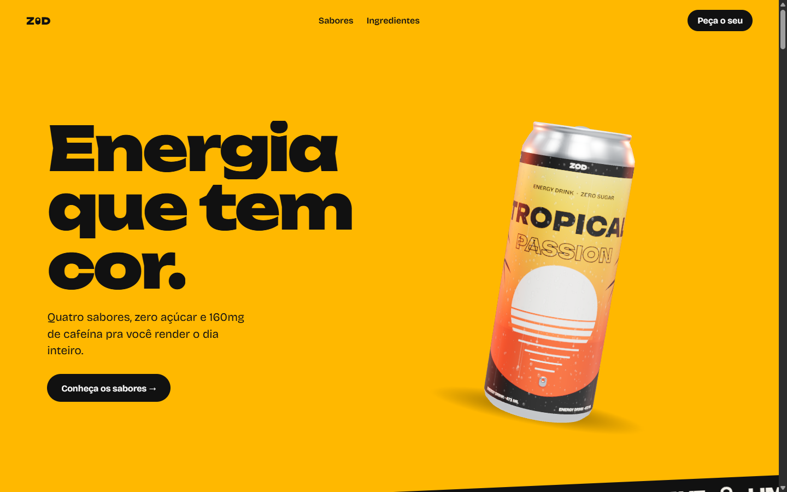
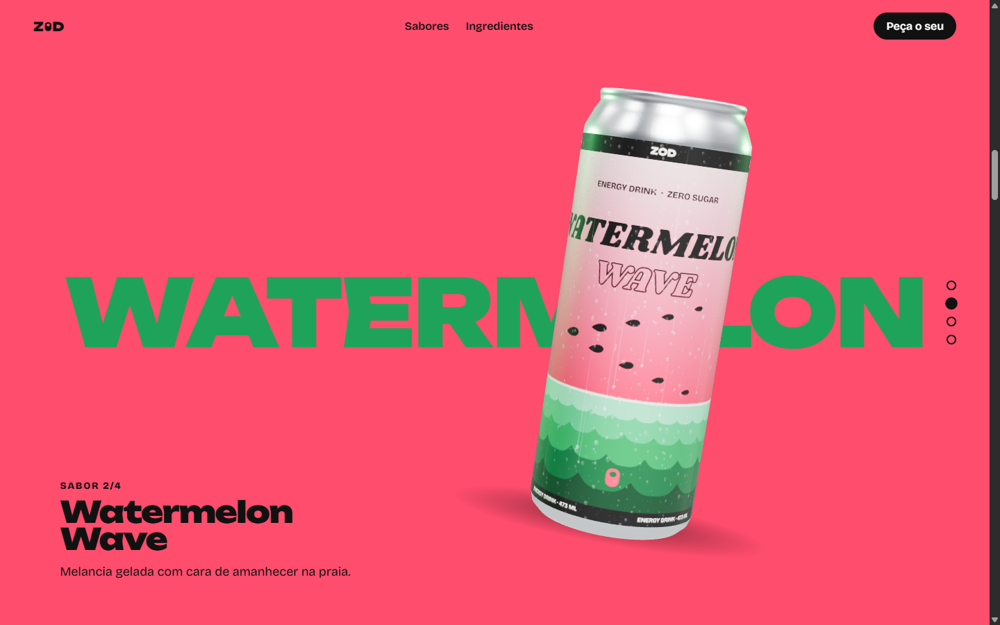
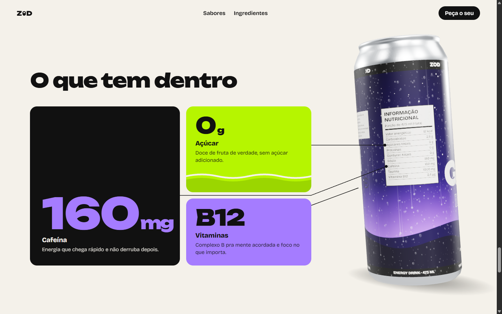

<div align="center">

# ZOD · Energia que tem cor

**Uma landing page 3D de energético, onde a lata é a protagonista e o scroll conta a história.**

Projeto de estudo de **UX, motion design e 3D na web**, criado por **Guilherme Sola Garcia**.


<br>



</div>

---

## Sobre o projeto

A **ZOD** é uma marca fictícia de energético criada do zero para responder uma pergunta: *até onde dá pra levar a experiência de uma landing page quando o produto é um objeto 3D de verdade, e não uma foto?*

O resultado é uma página em que **uma única lata tallboy, modelada em código**, acompanha o visitante do começo ao fim. Ela cai na tela, abre o lacre, gira para apresentar cada sabor, troca de rótulo como se fosse líquido enchendo, vira de costas para mostrar a tabela nutricional e termina ao lado das irmãs, na chamada final.

O foco do projeto foi **aprender fazendo**: direção de arte, coreografia de scroll, renderização 3D em tempo real, acessibilidade em interfaces animadas e o processo de iterar um design com feedback real até ele ficar certo.

> A ZOD não existe (ainda). Nome, rótulos, sabores e textos foram criados para este projeto.

---

## A experiência

| Momento | O que acontece |
|---|---|
| **Abertura** | A lata cai quicando, o título sobe palavra por palavra e o lacre estala e abre. |
| **Faixa de sabores** | Uma faixa inclinada atravessa a tela com os quatro sabores, separados pelo símbolo do lacre. |
| **Sabores** | A seção trava na tela. A cada trecho de scroll a lata dá uma volta e o rótulo novo **sobe como líquido**, sincronizado com a onda que troca a cor do fundo. O nome do sabor aparece gigante **atrás** da lata. |
| **O que tem dentro** | A seção trava de novo. A lata vira e mostra o **verso com a tabela nutricional**, e cada card (160mg, 0g, B12) entra com uma linha que se desenha até o item correspondente no rótulo. |
| **Peça o seu** | As quatro latas aparecem lado a lado. Passar o mouse levanta a lata e clicar leva direto àquele sabor. |

Detalhes que sustentam a sensação de objeto real:

- **Física de scroll:** a lata inclina quando você rola rápido e volta devagar, com mola.
- **Luz de recorte** tingida pela cor de cada sabor.
- **Gotas de condensação** escorrendo e reflexos de alumínio no metal.
- **Cursor** que assume a cor do sabor atual (só no desktop).



---

## Os sabores

Cada lata tem um rótulo próprio, desenhado em código, mas todas seguem as mesmas regras de família: faixas pretas com a marca, o lacre como símbolo, a primeira palavra gigante e a segunda vazada.

| Sabor | Cores | Conceito do rótulo |
|---|---|---|
| **Tropical Passion** | `#FFB800` · `#FF5A1F` | Pôr do sol numa baía, com palmeiras em silhueta |
| **Watermelon Wave** | `#FF4D6D` · `#1FA35B` | Amanhecer no mar que é, em segredo, um corte de melancia: o céu é a polpa, o horizonte é o filete branco, o mar é a casca e as sementes viram um bando de pássaros |
| **Lime Volt** | `#B6F500` · `#0E7C3A` | Uma onda elétrica dividindo os dois verdes |
| **Grape Midnight** | `#A57CFF` · `#24135F` | Céu da meia-noite, com o lacre no lugar da lua |



---

## Processo de design

O projeto passou por um ciclo completo de UX, documentado no repositório:

1. **Descoberta e direção:** vibe *pop minimalista* (cores saturadas, layout limpo), público de portfólio, 3D como protagonista.
2. **Protótipos navegáveis:** três experiências 3D comparadas lado a lado (lata no scroll, carrossel, cena imersiva) antes de escrever qualquer código definitivo.
3. **Identidade:** tipografia (Unbounded nos títulos, Bricolage Grotesque no resto), paleta por sabor e o **lacre** como símbolo, minimalista o bastante para ser reconhecido de longe.
4. **Rótulos iterados até ficarem certos:** cada lata foi redesenhada várias vezes com base em feedback, incluindo uma Watermelon Wave que só nasceu na quinta tentativa.
5. **Especificação e plano:** a [especificação de design](docs/superpowers/specs/2026-10-01-landing-energetico-design.md) e o [plano de implementação](docs/superpowers/plans/2026-10-01-landing-energetico.md) guiaram o desenvolvimento em tarefas pequenas, cada uma revisada.
6. **Teste com gente de verdade:** depois de navegar na página, o feedback mudou bastante coisa. Som e partículas saíram, o scroll ficou mais lento e mais "pesado", a chamada final foi reorganizada e a seção de ingredientes ganhou o próprio momento.
7. **Auditoria de "anti-slop":** a página foi revisada contra uma lista de padrões genéricos de sites feitos no automático (cards iguais, contraste ruim, CTAs duplicados, movimento sem motivo) e corrigida.

O princípio que guiou tudo: **todo movimento precisa de um motivo**. Se uma animação não conta a história, chama atenção para o que importa ou responde a uma ação, ela não entra.

---

## Por baixo do capô

### Stack

- **[Vite](https://vite.dev/)** para desenvolvimento e build
- **[Three.js](https://threejs.org/)** para a lata, a luz, o ambiente e o shader da troca líquida
- **[GSAP](https://gsap.com/) + ScrollTrigger + ScrollSmoother** para a coreografia de scroll, as seções travadas e a rolagem suave
- **JavaScript puro (ES Modules)**, sem framework de UI
- **`node --test`** para os testes, sem dependências extras

### Destaques técnicos

- **Lata 100% procedural.** Corpo, ombro, fundo e o lacre extrudado a partir do mesmo SVG do símbolo da marca. Nenhum modelo externo.
- **Rótulos desenhados em canvas** em quatro passes (cor, rugosidade, metalicidade e relevo), viram materiais físicos com verniz.
- **Troca líquida em shader:** o material mistura dois rótulos com uma borda ondulada que sobe pela lata, controlada por um único valor de 0 a 1, o mesmo que move a onda do fundo da página. É isso que mantém os dois sempre sincronizados.
- **Estado de scroll centralizado:** só o `scroll.js` lê a rolagem. Ele escreve num objeto de estado simples, e a cena 3D apenas lê esse estado a cada quadro.
- **Lógica pura e testada:** a conversão "posição do scroll → sabor + progresso da troca", o ângulo de apresentação da lata e a conversão de coordenadas do rótulo para pontos 3D são funções puras com testes.
- **Linhas guia ancoradas no 3D:** cada item da tabela nutricional é convertido de coordenada do rótulo para um ponto no mundo 3D e projetado na tela, para as linhas dos cards caírem exatamente no lugar certo.

### Arquitetura

```
index.html          as seções em HTML de verdade (legíveis mesmo sem 3D)
src/
  main.js           liga tudo e roda o loop de renderização
  scroll.js         estado, poses da lata, seções travadas, rolagem suave
  scrollState.js    lógica pura: sabor atual, progresso da troca, giro
  scene.js          renderer, câmera, luzes e ambiente
  can.js            a lata: geometria, shader da troca, lacre, condensação
  labels.js         os quatro rótulos, desenhados em canvas
  flavors.js        marca e sabores (o nome da marca vive só aqui)
  cursor.js         cursor na cor do sabor
  style.css         layout, tokens e responsivo
tests/              testes das funções puras
tools/              páginas de preview da lata e dos rótulos
```

---

## Acessibilidade e performance

Animação bonita não pode ser animação excludente:

- **`prefers-reduced-motion`:** com animações reduzidas no sistema, a lata fica parada, as seções aparecem prontas e nada se move sozinho.
- **Sem WebGL:** a página continua funcionando, com uma imagem estática da lata no lugar do canvas.
- **Celular:** poses próprias para a lata não cobrir o texto, rótulos em meia resolução para economizar memória e sem cursor customizado.
- **Conteúdo real em HTML:** todo texto é HTML de verdade, legível por leitores de tela e buscadores. As camadas decorativas são escondidas da árvore de acessibilidade.
- **Botões reais:** os rótulos das latas na chamada final são botões navegáveis por teclado.
- **Texturas pré-carregadas** antes do primeiro quadro, para a troca de sabor não engasgar no meio do scroll.

---

## Como rodar

Pré-requisitos: **Node.js 20+**.

```bash
# instalar as dependências
npm install

# servidor de desenvolvimento
npm run dev

# testes
npm test

# build de produção
npm run build
npm run preview
```

> Abra a página pelo `npm run dev`. Abrir o `index.html` direto no navegador não funciona, porque o Vite é quem carrega os estilos e os módulos.

---

## O que eu aprendi

- **Coreografar scroll** é design de narrativa: cada seção precisa de tempo para respirar, e "mais rápido" quase nunca é "melhor".
- **3D na web** é tanto sobre materiais e luz quanto sobre geometria. Um verniz bem calibrado vale mais que mil polígonos.
- **Testar com alguém** muda o projeto: metade das melhores decisões daqui veio depois de outra pessoa navegar na página.
- **Acessibilidade em interfaces animadas** se resolve pensando no caminho sem animação desde o início, e não no fim.
- **Restrição gera identidade:** uma paleta fixa e um único símbolo deram mais personalidade à marca do que qualquer efeito.

---

## Autor

**Guilherme Sola Garcia**

Projeto pessoal de estudo em UX, motion design e 3D para web.

[](https://github.com/guilhermesolagarcia)

---

<div align="center">

*ZOD é uma marca fictícia, criada para fins de estudo e portfólio.*

</div>
